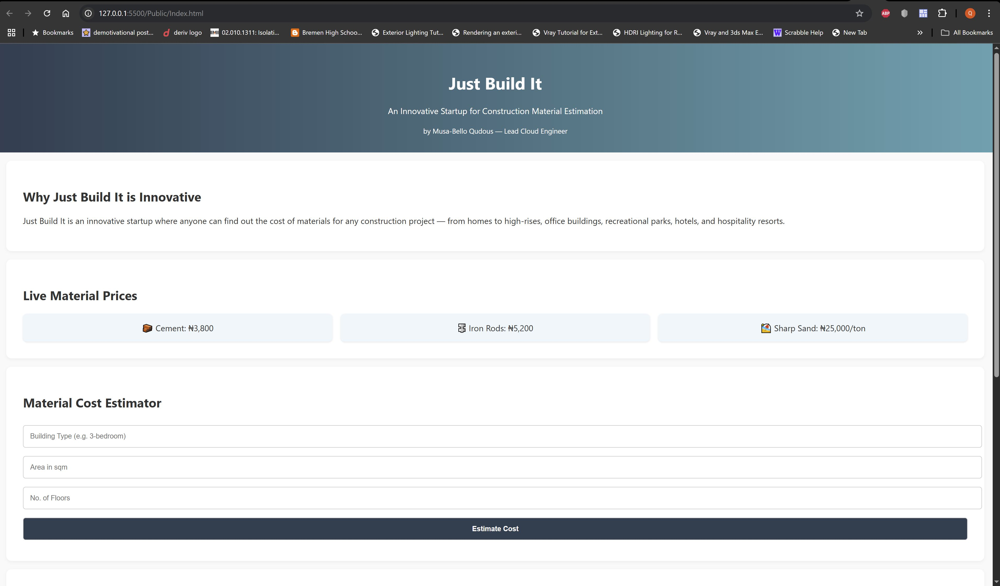

# Just Build It – Startup Prototype

## Project Title
**The Future of Just Build It**

## Hosted Page
[http://35.179.90.61](http://35.179.90.61)

## Screenshot

## Tech Stack
- Node.js
- Express.js
- Nginx (reverse proxy)
- Tailwind CSS
- AWS EC2 (Ubuntu 22.04)
- Let’s Encrypt SSL

## Deployment Steps

1. Provision EC2 on AWS
2. Install Node.js and create app
3. Set up Nginx as reverse proxy
4. Enable ports 80/443 in EC2
5. Secure app with Let's Encrypt SSL
6. Create a dynamic landing page

